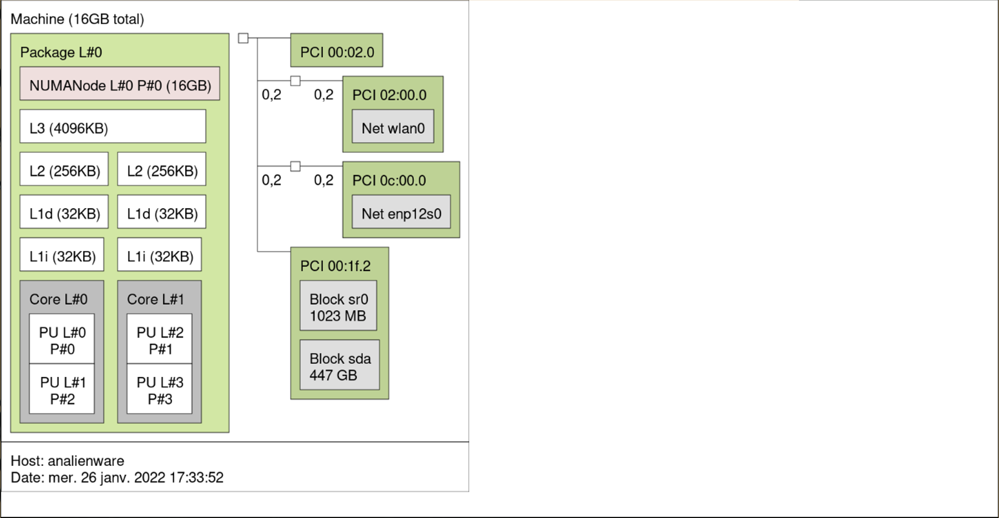

# Caractéristiques de nos machines

Voici l'affichage de `cat /proc/cpuinfo` et de `lstopo` sur
nos deux machines.

## Ana

```
processor	: 0
vendor_id	: GenuineIntel
cpu family	: 6
model		: 58
model name	: Intel(R) Core(TM) i7-3540M CPU @ 3.00GHz
stepping	: 9
microcode	: 0x21
cpu MHz		: 3700.000
cache size	: 4096 KB
physical id	: 0
siblings	: 4
core id		: 0
cpu cores	: 2
apicid		: 0
initial apicid	: 0
fpu		: yes
fpu_exception	: yes
cpuid level	: 13
wp		: yes
flags		: fpu vme de pse tsc msr pae mce cx8 apic sep mtrr pge mca cmov pat pse36 clflush dts acpi mmx fxsr sse sse2 ss ht tm pbe syscall nx rdtscp lm constant_tsc arch_perfmon pebs bts rep_good nopl xtopology nonstop_tsc cpuid aperfmperf pni pclmulqdq dtes64 monitor ds_cpl vmx smx est tm2 ssse3 cx16 xtpr pdcm pcid sse4_1 sse4_2 x2apic popcnt tsc_deadline_timer aes xsave avx f16c rdrand lahf_lm cpuid_fault epb pti ssbd ibrs ibpb stibp tpr_shadow vnmi flexpriority ept vpid fsgsbase smep erms xsaveopt dtherm ida arat pln pts md_clear flush_l1d
vmx flags	: vnmi preemption_timer invvpid ept_x_only flexpriority tsc_offset vtpr mtf vapic ept vpid unrestricted_guest
bugs		: cpu_meltdown spectre_v1 spectre_v2 spec_store_bypass l1tf mds swapgs itlb_multihit srbds
bogomips	: 5982.61
clflush size	: 64
cache_alignment	: 64
address sizes	: 36 bits physical, 48 bits virtual
power management:

processor	: 1
vendor_id	: GenuineIntel
cpu family	: 6
model		: 58
model name	: Intel(R) Core(TM) i7-3540M CPU @ 3.00GHz
stepping	: 9
microcode	: 0x21
cpu MHz		: 3700.000
cache size	: 4096 KB
physical id	: 0
siblings	: 4
core id		: 1
cpu cores	: 2
apicid		: 2
initial apicid	: 2
fpu		: yes
fpu_exception	: yes
cpuid level	: 13
wp		: yes
flags		: fpu vme de pse tsc msr pae mce cx8 apic sep mtrr pge mca cmov pat pse36 clflush dts acpi mmx fxsr sse sse2 ss ht tm pbe syscall nx rdtscp lm constant_tsc arch_perfmon pebs bts rep_good nopl xtopology nonstop_tsc cpuid aperfmperf pni pclmulqdq dtes64 monitor ds_cpl vmx smx est tm2 ssse3 cx16 xtpr pdcm pcid sse4_1 sse4_2 x2apic popcnt tsc_deadline_timer aes xsave avx f16c rdrand lahf_lm cpuid_fault epb pti ssbd ibrs ibpb stibp tpr_shadow vnmi flexpriority ept vpid fsgsbase smep erms xsaveopt dtherm ida arat pln pts md_clear flush_l1d
vmx flags	: vnmi preemption_timer invvpid ept_x_only flexpriority tsc_offset vtpr mtf vapic ept vpid unrestricted_guest
bugs		: cpu_meltdown spectre_v1 spectre_v2 spec_store_bypass l1tf mds swapgs itlb_multihit srbds
bogomips	: 5982.61
clflush size	: 64
cache_alignment	: 64
address sizes	: 36 bits physical, 48 bits virtual
power management:

processor	: 2
vendor_id	: GenuineIntel
cpu family	: 6
model		: 58
model name	: Intel(R) Core(TM) i7-3540M CPU @ 3.00GHz
stepping	: 9
microcode	: 0x21
cpu MHz		: 2746.585
cache size	: 4096 KB
physical id	: 0
siblings	: 4
core id		: 0
cpu cores	: 2
apicid		: 1
initial apicid	: 1
fpu		: yes
fpu_exception	: yes
cpuid level	: 13
wp		: yes
flags		: fpu vme de pse tsc msr pae mce cx8 apic sep mtrr pge mca cmov pat pse36 clflush dts acpi mmx fxsr sse sse2 ss ht tm pbe syscall nx rdtscp lm constant_tsc arch_perfmon pebs bts rep_good nopl xtopology nonstop_tsc cpuid aperfmperf pni pclmulqdq dtes64 monitor ds_cpl vmx smx est tm2 ssse3 cx16 xtpr pdcm pcid sse4_1 sse4_2 x2apic popcnt tsc_deadline_timer aes xsave avx f16c rdrand lahf_lm cpuid_fault epb pti ssbd ibrs ibpb stibp tpr_shadow vnmi flexpriority ept vpid fsgsbase smep erms xsaveopt dtherm ida arat pln pts md_clear flush_l1d
vmx flags	: vnmi preemption_timer invvpid ept_x_only flexpriority tsc_offset vtpr mtf vapic ept vpid unrestricted_guest
bugs		: cpu_meltdown spectre_v1 spectre_v2 spec_store_bypass l1tf mds swapgs itlb_multihit srbds
bogomips	: 5982.61
clflush size	: 64
cache_alignment	: 64
address sizes	: 36 bits physical, 48 bits virtual
power management:

processor	: 3
vendor_id	: GenuineIntel
cpu family	: 6
model		: 58
model name	: Intel(R) Core(TM) i7-3540M CPU @ 3.00GHz
stepping	: 9
microcode	: 0x21
cpu MHz		: 1723.326
cache size	: 4096 KB
physical id	: 0
siblings	: 4
core id		: 1
cpu cores	: 2
apicid		: 3
initial apicid	: 3
fpu		: yes
fpu_exception	: yes
cpuid level	: 13
wp		: yes
flags		: fpu vme de pse tsc msr pae mce cx8 apic sep mtrr pge mca cmov pat pse36 clflush dts acpi mmx fxsr sse sse2 ss ht tm pbe syscall nx rdtscp lm constant_tsc arch_perfmon pebs bts rep_good nopl xtopology nonstop_tsc cpuid aperfmperf pni pclmulqdq dtes64 monitor ds_cpl vmx smx est tm2 ssse3 cx16 xtpr pdcm pcid sse4_1 sse4_2 x2apic popcnt tsc_deadline_timer aes xsave avx f16c rdrand lahf_lm cpuid_fault epb pti ssbd ibrs ibpb stibp tpr_shadow vnmi flexpriority ept vpid fsgsbase smep erms xsaveopt dtherm ida arat pln pts md_clear flush_l1d
vmx flags	: vnmi preemption_timer invvpid ept_x_only flexpriority tsc_offset vtpr mtf vapic ept vpid unrestricted_guest
bugs		: cpu_meltdown spectre_v1 spectre_v2 spec_store_bypass l1tf mds swapgs itlb_multihit srbds
bogomips	: 5982.61
clflush size	: 64
cache_alignment	: 64
address sizes	: 36 bits physical, 48 bits virtual
power management:
```



D'après likwid, la consommation énergétique est de TODO.

Les performances des programmes sur les matrices sont :

- TODOs pour Python ;
- TODOs pour Java ;
- TODOs pour C.

## Arthur


